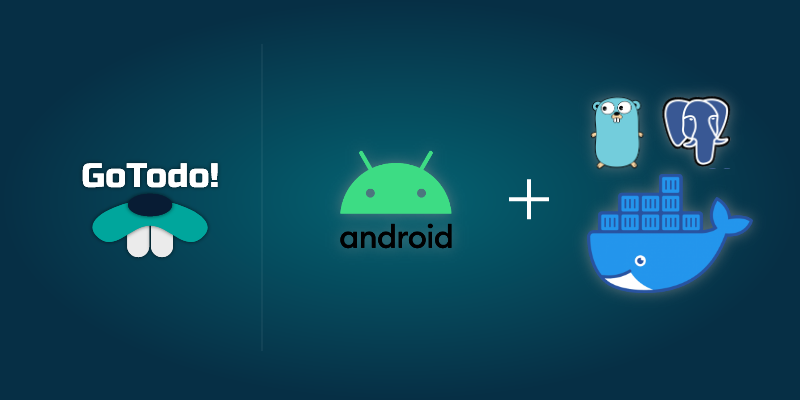
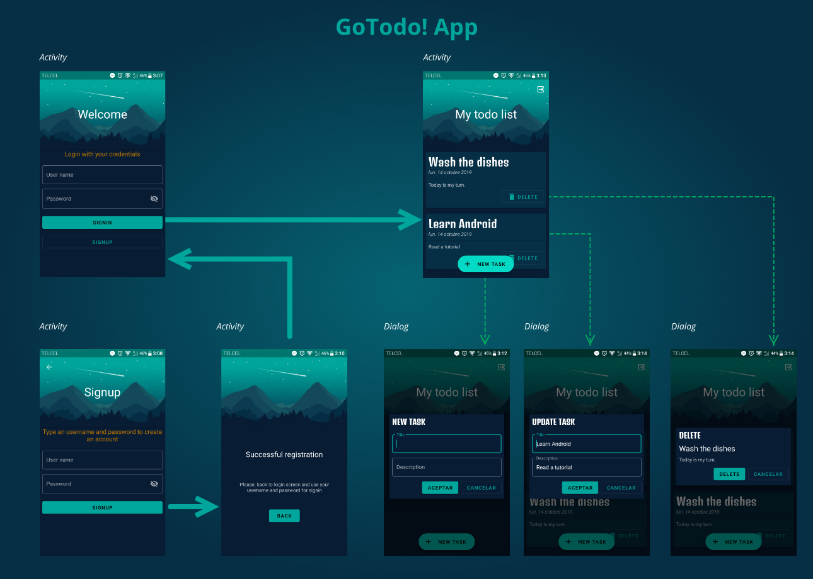

# GoTodo! Android App

Android Todo App, GoTODO! Part 2: Creating a simple MVP Android App with Retrofit

## More info

This repository is the source code of the GoTodo! Android App project from the next tutorial.

[Visit tutorial in Medium.com](https://medium.com/@carloslopez_19744/android-todo-app-gotodo-part-2-creating-a-simple-mvp-android-app-with-retrofit-6eec0d0b909f?source=friends_link&sk=44685ba983882025feab4dd6e4fe1cac)

